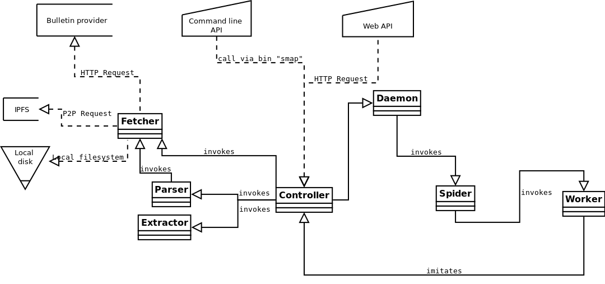
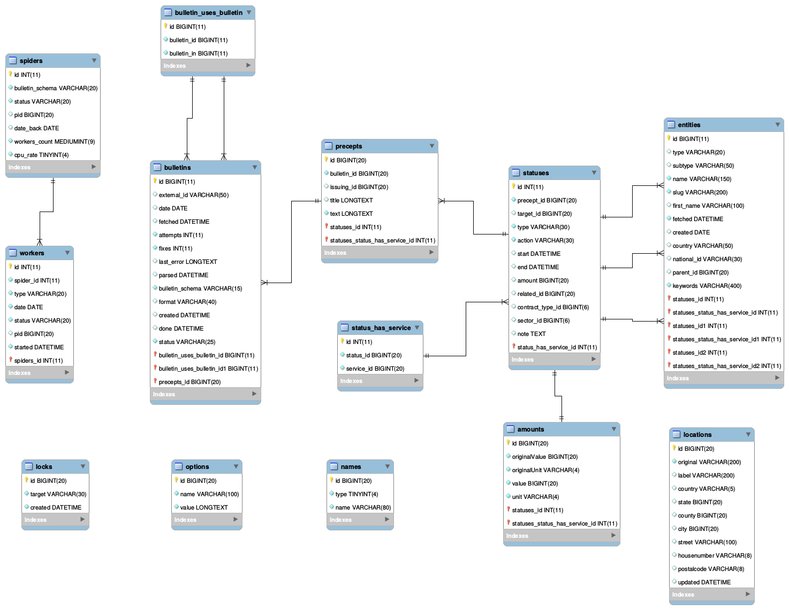

<p align="center">
	
</p>


*This software is a PHP/MySQL rewrite/redesign of [Kaos155](https://github.com/Ingobernable/kaos155/) developped by the same [Ingoberlab](https://hacklab.ingobernable.net/) team. It aims at providing a browser of all the world's public bulletins' data, and altogether analyze how bribery has been hiding through history.*

**Disclaimer:** StateMapper builds sheets about people based on their names (not ID numbers). This means one sheet may represent several people at the same time, with the exact same name(s) and last name(s).


### Index:

- [Manifest](#manifest)
- [Minimal requirements](#minimal-requirements)
- [Installation](#basic-installation)
- [IPFS Installation and checks](#ipfs-installation-and-checks-optional) *(optional)*
- [TOR Installation and checks](#tor-installation-and-checks-optional) *(optional)*
- [Usage](#test-statemapper)
  - [Command line API](#command-line-api-cli)
  - [Web GUI](#web-gui)
  - [Web API](#web-api)
  - [Daemon commands](#daemon-commands)
- [Contribute](#contribute-to-statemapper)
  - [Data extraction layers](#data-extraction-layers)
  - [Folder structure](#folder-structure)
  - [Bulletin schemas structure](#bulletin-schemas-structure)
  - [Schema transformations](#schema-transformations)
  - [Tips & tricks](#tips--tricks)
- [Known bugs](#known-bugs)
- [TODO's](#todos)


## Manifest

Official bulletins are a mess: unpublished or in unstructured manner, lots of plain text to read, no browser. And this is a key point to hide public bribary. StateMapper is born short after project Kaos155 has been uncovered, [... to be continued/replaced]


## Minimal requirements

StateMapper might work just well on any Debian-based system. Here are the requirement:

* PHP4+ (best PHP7+)
* MariaDB with its [TokuDB plugin](https://mariadb.com/kb/en/library/tokudb/) (though MySQL may be enough for local development)
* Apache 2.2+ with mod_rewrite enabled
* curl
* pdftotext (from poppler-utils)

* [IPFS](https://ipfs.io/) *(optional)*
* [TOR](https://www.torproject.org/) *(optional)*


## Basic installation

1. Install dependencies: *(if MySQL is installed, it will be replaced by MariaDB)*
   ```bash
   sudo apt-get install php7.0 apache2 libapache2-mod-php mariadb-plugin-tokudb php-mcrypt php-mysql curl poppler-utils
   ```

2. Install TokuDB following [these instructions](https://mariadb.com/kb/en/library/enabling-tokudb/). 

3. OPTIONAL: Install IPFS following [these instructions](https://ipfs.io/docs/install/). Then enter:

   ```bash
   ipfs init
   ipfs daemon& 			# wait 3 seconds and press Ctrl+L to clear the screen
   ipfs cat /ipns/...... 		# shoud print something if IPFS is well configured
   ```

4. OPTIONAL: Install TOR following [these instructions](https://www.torproject.org/docs/debian.html.en).  
   
   Then edit ```/etc/tor/torrc```. Uncomment ```ControlPort 9051```, uncomment ```CookieAuthentication 0``` and set it to 1 (```CookieAuthentication 1```). Save and close. Then enter:  

   ```bash
   sudo service tor restart	 		# make sure TOR is running
   curl ifconfig.me/ip				# should print your real IP
   torify curl ifconfig.me/ip			# should print another IP
   print 'AUTHENTICATE ""\r\nsignal NEWNYM\r\nQUIT' | nc 127.0.0.1 9051
   torify curl ifconfig.me/ip 			# should print yet another IP
   ```

5. Clone this repository to a dedicated folder in your Apache working directory: (most probably ```/var/www```)

   ```
   mkdir /var/www/statemapper
   cd /var/www/statemapper
   git clone https://github.com/StateMapper/StateMapper
   ```

6. Edit ```config.php``` and change the constants according to your needs (follow the instructions in comments).

7. OPTIONAL: Setup an ```smap``` alias to access the CLI API easily, from anywhere. Enter:

   ```bash 
   echo 'alias smap="/var/www/statemapper/scripts/statemapper "' >> ~/.bashrc
   source ~/.bashrc		# read ~/.bashrc again
   smap					# should print the CLI help
   ```
   
   *Disclaimer: all ```smap``` calls require root login because PHP requires to be executed with the same user as the Apache server (most likely ```www-data```) to be able to read-write files correctly.*


8. Restart the web server and visit the Web GUI:

   ```bash
   sudo a2enmod rewrite			# enable Apache's mod_rewrite
   sudo service apache2 restart 	# make sure Apache is running
   sudo service mysql restart 	# make sure MySQL is running
   ```
   Then open a browser and navigate to http://localhost/statemapper/app/
   Like with the CLI API, most frontend URLs can be appended ```/raw``` to get a raw JSON equivalent.


### Daemon commands:

If you want the spiders to be able to start, it is required to start the daemon with ```smap daemon start```. Here are the available daemon commands:

```bash
smap daemon [start] 		# start the daemon in the background
smap daemon -d 			# start it in debug mode (do not daemonize)
smap daemon stop 		# stop it smoothly (wait for the workers)
smap daemon kill 		# kill it (for emergencies only)
```


## Contribute to StateMapper:

If you like this software and its goals, there surely are many ways you can get involved!

The project's current workforce splits into three commissions:

| Commission | Responsability |
| ----- | ------ |
| Counter-bribery Strategists | in charge of the project's strategy and communication |
| Core Wizards | in charge of improving the core code |
| Schema Soldiers | in charge of implementing more bulletin schemas |
| Country Ambassadors | in charge of hosting bulletin IPFS nodes |

.. and any of the following would help us all a lot!

**Map yet another bulletin!** You're a JS/json/regexp developer? Help us by implementing a missing bulletin of your choice. It can be from whichever country, region or city, the goal being to get interesting information out!

**Improve our code!** You're a PHP/MySQL developer? Push us some core code improvements or bugfixes! Come to our team meetings if you wish.

**Translate to a new language!** Thanks to [PoEdit](https://poedit.net/), it is really easy to translate StateMapper to whatever language you speak. And it can really help the project to spread!

**Share this project!** and tell everyone how it can help us out with the world's dramatic public bribery situation.

**Donate to us**, coming to the [Ingobernable](https://ingobernable.net) and asking for the Kaos team :)


If you simply think you just had a great idea, or you have skills we may seek, do not hesitate to contact us through [this email](statemapper@riseup.net)!


If you wish to help with the core code or bulletin schemas, you may want to learn what follows before starting to code:

### Folder structure:

| Folder | Description |
| ------- | ------ |
| [app](app) | core files of the app |
| [app/controller](app/controller) | controller layer |
| [app/fetcher](app/fetcher) | fetch layer |
| [app/parser](app/parser) | parse layer |
| [app/extractor](app/extractor) | extract layer |
| [app/spider](app/spider) | spider (and workers) layer |
| [app/api](app/api) | api controller layer |
| [app/browser](app/browser) | frontend browser |
| [app/templates](app/templates) | page and partial templates |
| [app/helpers](app/helpers) | helper functions |
| [app/addons](app/addons) | addons likes Wikipedia suggs, Geoencoding, Website autodetection..  |
| [app/languages](app/languages) | translation files |
| [app/database](app/database) | database .sql files |
| [app/assets](app/assets) | web assets of the app (images, fonts, .css, .js) |
| | |
| [schemas](schemas) | bulletin definitions (schemas) |
| [bulletins](bulletins) | bulletins stored after download |
| [scripts](scripts) | bash scripts |
| [documentation](documentation) | extra documentation (graphic material, diagrams..) |

### Bulletin schemas structure:

Bulletin schemas are the definition files of each bulletin, issuing institution and country. They are ordered as follow:

| File path | Description | Example |
| ------------ | --------------- | ------- |
| ```bulletins/XX/XX.json``` | country or continent schema | [bulletins/ES/ES.json](bulletins/ES/ES.json) |
| ```bulletins/XX/ISSUING_NAME.json``` | issuing institution's schema | [bulletins/ES/AGENCIA_ESTATAL.json](bulletins/ES/AGENCIA_ESTATAL.json) |
| ```bulletins/XX/ISSUING_NAME.png``` | 64x64px picture for the issuing institution | [bulletins/ES/AGENCIA_ESTATAL.png](bulletins/ES/AGENCIA_ESTATAL.png) |
| ```bulletins/XX/BULLETIN_NAME.json``` | bulletin's schema | [bulletins/ES/BOE.json](bulletins/ES/BOE.json) |
| ```bulletins/XX/BULLETIN_NAME.png``` | 64x64px picture for the bulletin | [bulletins/ES/BOE.png](bulletins/ES/BOE.png) |

Continents and countries are all first level folders (bulletins/EU and bulletins/ES). Country/continent flags are taken from ```app/assets/images/flags/XX.png```.

Within each bulletin's schema, the following parts are the most important:

| Schema part | Description |
| ----- | ----- |
| guesses | set of rules to guess query parameters from other parameteres |
| fetchProtocoles | set of rules to fetch bulletins according to available parameters (date, id, url..) |
| parsingProtocoles | set of rules to parse the fetched bulletins (mostly XPath and Regexp) |
| extractProtocoles | final statuses to be extracted from the parsed object |

### Data extraction layers:

- **fetch**:		in charge of downloading bulletins from original source.
- **parse**:		in charge of parsing bulletins and triggering subsequent fetches (follows).
- **extract**:	in charge of extracting precepts and status from parsed object.




### Schema transformations:

 * parseDate: parse date
 * parseDatetime: parse date and time
 * assign: replace content by pattern
 * parseList: extract list bullet/number
 * [.. to fill]

### URI structure:

| URI pattern  | Page description |
| ------------- | ------------- |
| [/](https://statemapper.net/) | site root |
| [/?etype=institution](https://statemapper.net/?etype=institution) | list of all extracted institutions |
| [/?etype=company](https://statemapper.net/?etype=company) | list of all extracted companies |
| [/?etype=person](https://statemapper.net/?etype=person) | list of all extracted people |
| | |
| /xx/institution/itsname | the sheet of an institution from country xx |
| /xx/company/mycompany	| the sheet of a company from country xx |
| /xx/person/john-doe | the sheet of a person from country xx |
| | |
| [/api](https://statemapper.net/api) | list of countries, bulletin providers and schemas |
| [/api/xx](https://statemapper.net/api/es) | list of bulletin providers and schemas for country xx (example: /api/es) |

### Extracted statuses




### Tips & tricks:

* When developping and fetching lots of bulletins, sometimes you won't have enough space on your local disk.
To move everything to a new disk, we recommend using the following command:

```bash
rsync -arv --size-only /path/to/statemapper/data/ /path/to/your/external_disk/statemapper/data
```

Then modify the DATA_PATH in ```config.php```.

* To delete all files from a specific extension (say .pdf), use the following:

```bash
find /path/to/statemapper/data/ -name "*.pdf" -type f -delete
```

* To edit this README, you may find useful to use this [Github README editor tool](https://jbt.github.io/markdown-editor/).
* To read/edit ```documentation/database_diagram.mwb```, you may use [MySQL Workbench](https://www.mysql.com/products/workbench/design/).
* To read/edit ```documentation/classes_diagram.dia```, you may use [Dia](http://dia-installer.de/download/linux.html): ```sudo apt-get install dia```
* In general, you may use "?stop=1" to stop auto-refreshing (the rewind map, for example), and be able to edit the DOM/CSS more easily.
* In general, you may use "?human=1" to format a raw JSON output for humans.
* The main logo was made using the [Nasalization font](app/assets/font/nasalization) and the [FontAwesome](http://fontawesome.io/icons/)'s "map-signs" icon.

## Known bugs:

* Chromium can't manage to display well XML within iframes
* frontend iframe is cut from the bottom in fetch/lint mode
* [fill...]

## TODO's:

**Data representation:**
- Store location objects, and at extraction time?
- Parse and understand/represent institutions' levels
- Parse and understand/represent geographical levels (province, city..)
- Detect sub-companies of given companies
- Improve filters (think it for entity sheets, entity listings and search results, separately).
- Maybe rebuid the Controller/API handling?
- Add API endpoints for entity sheets (summary + details) and rewind mode (yearly stats).

**UI/UX:**

- Replace dev mode's date pickers by jQuery ones (FF doesn't implement HTML5 date fields)
- Improve dev quick commands (on the title's tick in a bulletin's schema) for each seperated bulletin.
- Check/rewrite install page
- Add i18n function ("_('bla')") to all labels and translate to Spanish with poedit app/languages/es_ES/LC_MESSAGES + handle web language cookie?
- Rename scripts to statemapper?
- Implement commands "daemon status" and "daemon restart"
- Leave enough open for researchers to be able to fill in (and share?) bulletins and data manually (for official bulletins that may not have been scanned by the state, ever).


## License

The StateMapper software and all its documentation are licensed under the **GNU General Public License v3.0**, also included in our repository in the [COPYING](COPYING) file.

StateMapper uses [jQuery](http://jquery.com/) ([MIT](https://tldrlegal.com/license/mit-license)), [FontAwesome](http://fontawesome.io/icons/) ([SIL OFL 1.1 & MIT](http://fontawesome.io/license/)) and [Tippy.js](https://atomiks.github.io/tippyjs/) ([MIT](https://tldrlegal.com/license/mit-license)).


## Contact us

Please write us at [statemapper@riseup.net](mailto:statemapper@riseup.net) or come to chat at [statemapper@conference.riseup.net](statemapper@conference.riseup.net) ([Jabber/XMPP](https://jabber.at/p/clients/)).

-----

*StateMapper &copy; 2017 [StateMapper.net](https://statemapper.net) & [Ingoberlab](https://hacklab.ingobernable.net)*

