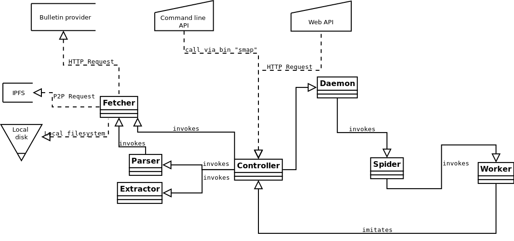

<p align="center" id="top">
	<a href="https://github.com/StateMapper/StateMapper" title="Go to the project's homepage"></a>
</p>
<p align="center">
	<strong>DEVELOPERS GUIDE</strong>
</p>

*[&larr; Project's homepage](https://github.com/StateMapper/StateMapper#top)*


-----

**Index:** [Dataflow layers](#dataflow-layers) / [Folder structure](#folder-structure) / [Schema structure](#schema-structure) / [Schema transformations](#schema-transformations) / [Data extraction](#data-extraction) / [URI structure](#uri-structure) / [Tips & tricks](#tips--tricks)


## Dataflow layers:

| Layer name | Responsability |
| -------- | ---- |
| controller + api | route calls and prepare data for the templates |
| fetch | download bulletins from bulletin providers |
| parse | parse bulletins and trigger subsequent fetches (follows) |
| extract | extract precepts and status from parsed objects |
| spider | trigger workers to fetch, parse and extract bulletins |
| daemon | start and stop bulletin spiders |




## Folder structure:

| Folder | Description |
| ------- | ------ |
| [schemas/](../../schemas) | bulletin definitions (schemas) |
| [bulletins/](../../bulletins) | where bulletins are stored after download |
| [scripts/](../../scripts) | bash scripts (command ```smap```) |
| [documentation/](../../documentation) | documentation file (graphic material, diagrams, manuals..) |
| [app/](../../app) | core files of the app |
| [app/controller/](../../app/controller) | controller layer |
| [app/fetcher/](../../app/fetcher) | fetch layer |
| [app/parser/](../../app/parser) | parse layer |
| [app/extractor/](../../app/extractor) | extract layer |
| [app/spider/](../../app/spider) | spider (and workers) layer |
| [app/api/](../../app/api) | api controller layer |
| [app/browser/](../../app/browser) | frontend browser |
| [app/templates/](../../app/templates) | page and partial template files |
| [app/helpers/](../../app/helpers) | helper functions |
| [app/addons/](../../app/addons) | addons likes Wikipedia suggs, Geoencoding, Website autodetection..  |
| [app/languages/](../../app/languages) | translation files |
| [app/database/](../../app/database) | database .sql files |
| [app/assets/](../../app/assets) | web assets of the app (images, fonts, .css, .js) |

## Schema structure:

Bulletin schemas are the definition files for each bulletin, issuing institution and country. They are organized as follows:

| File path | Description | Example |
| ------------ | --------------- | ------- |
| ```schemas/XX/XX.json``` | country or continent schema | [schemas/ES/ES.json](../../schemas/ES/ES.json) |
| ```schemas/XX/ISSUING_NAME.json``` | issuing institution's schema | [schemas/ES/AGENCIA_ESTATAL.json](../../schemas/ES/AGENCIA_ESTATAL.json) |
| ```schemas/XX/ISSUING_NAME.png``` | 64x64px picture for the issuing institution | [schemas/ES/AGENCIA_ESTATAL.png](../../schemas/ES/AGENCIA_ESTATAL.png) |
| ```schemas/XX/BULLETIN_NAME.json``` | bulletin's schema | [schemas/ES/BOE.json](../../schemas/ES/BOE.json) |
| ```schemas/XX/BULLETIN_NAME.png``` | 64x64px picture for the bulletin | [schemas/ES/BOE.png](../../schemas/ES/BOE.png) |

Continents and countries are all first level folders (```schemas/ES```, not ```schemas/EU/ES```). Country and continent flags are automatically taken from ```app/assets/images/flags/XX.png```.

Within each bulletin's schema, the following parts are the most important:

| Schema part | Description |
| ----- | ----- |
| guesses | set of rules to guess query parameters from other parameteres |
| fetchProtocoles | set of rules to fetch bulletins according to available parameters (date, id, url..) |
| parsingProtocoles | set of rules to parse the fetched bulletins (mostly XPath and Regexp) |
| extractProtocoles | final statuses to be extracted from the parsed object |

To implement a new schema, please take example on [ES/ES](../../schemas/ES/ES.json), [ES/AGENCIA_ESTATAL](../../schemas/ES/AGENCIA_ESTATAL.json), [ES/BOE](../../schemas/ES/BOE.json) and [ES/BORME](../../schemas/ES/BORME.json).

## Schema transformations:

| Name | Description |
| ----- | ---- |
| parseDate | parse date |
| parseDatetime | parse date and time |
| assign | replace content by pattern |
| parseList | extract list bullet/number |


## Data extraction:

The extraction layer is where data is finally saved to the database in the form of very small pieces of information (called *status*), linked to their original text (called *precept*). During this step, several tables are filled:

| Table | Content |
| ---- | ----- |
| precepts | original text to extract information from |
| statuses | single, small information about one or several entities |
| entities | legal actors; currently of three types: *person*, *company* and *institution* |
| amounts | amounts related with the status, with units and USD values |
| locations | locations related with the status |

Status are sorted by ```type``` and ```action``` as follows:

| Status type | Action | Meaning | Arguments |
| ---- | ----- | ----- | ---- |
| name | new | company foundation | note: the company name |
| name | update | name change | target_id: the new entity |
| name | end | company dissolution | | |
| administrator | start | start as an administrator | target_id: the administering entity |


## URI structure:

| URI pattern  | Page description |
| ------------- | ------------- |
| [/](https://statemapper.net/) | site root |
| [/?etype=institution](https://statemapper.net/?etype=institution) | list of all extracted institutions |
| [/?etype=company](https://statemapper.net/?etype=company) | list of all extracted companies |
| [/?etype=person](https://statemapper.net/?etype=person) | list of all extracted people |
| | |
| /xx/institution/itsname | the sheet of an institution from country xx |
| /xx/company/mycompany	| the sheet of a company from country xx |
| /xx/person/john-doe | the sheet of a person from country xx |
| | |
| [/api](https://statemapper.net/api) | list of countries, bulletin providers and schemas |
| [/api/xx](https://statemapper.net/api/es) | list of bulletin providers and schemas for country xx (example: /api/es) |


## Tips & tricks:

* If you ever need to hide yourself when pushing changes, we recommend you create a Github user with a dedicated mailbox from [RiseUp](https://account.riseup.net/user/new) or [ProtonMail](https://protonmail.com/signup). Also, we recommend you also use RiseUp's [VPN Red](https://riseup.net/en/vpn). To do so, follow [these instructions](https://riseup.net/en/vpn/vpn-red/linux).

* When developping and fetching lots of bulletins, sometimes you won't have enough space on your local disk.
To move everything to a new disk, we recommend using the following command:

```bash
rsync -arv --size-only /path/to/statemapper/data/ /path/to/your/external_disk/statemapper/data
```

Then modify the ```DATA_PATH``` in ```config.php```.

* To delete all files from a specific extension (say .pdf), use the following:

```bash
find /path/to/statemapper/data/ -name "*.pdf" -type f -delete
```

* To edit Github manuals, you may find useful to use this [Github README editor tool](https://jbt.github.io/markdown-editor/).
* To read/edit ```documentation/database_diagram.mwb```, you may use [MySQL Workbench](https://www.mysql.com/products/workbench/design/).
* To read/edit ```documentation/classes_diagram.dia```, you may use [Dia](http://dia-installer.de/download/linux.html): ```sudo apt-get install dia```
* In general, you may use "?stop=1" to stop auto-refreshing (the rewind map, for example), and be able to edit the DOM/CSS more easily.
* In general, you may use "?human=1" to format a raw JSON output for humans.
* The main logo was made using the [Nasalization font](../../app/assets/font/nasalization) and the [FontAwesome](http://fontawesome.io/icons/)'s "map-signs" icon.


-----

*[&larr; Project's homepage](https://github.com/StateMapper/StateMapper#top) / Copyright &copy; 2017 [StateMapper.net](https://statemapper.net) / Licensed under [GNU GPLv3](../../COPYING) / [&uarr; top](#top)*  
