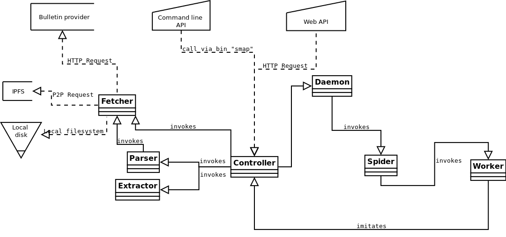
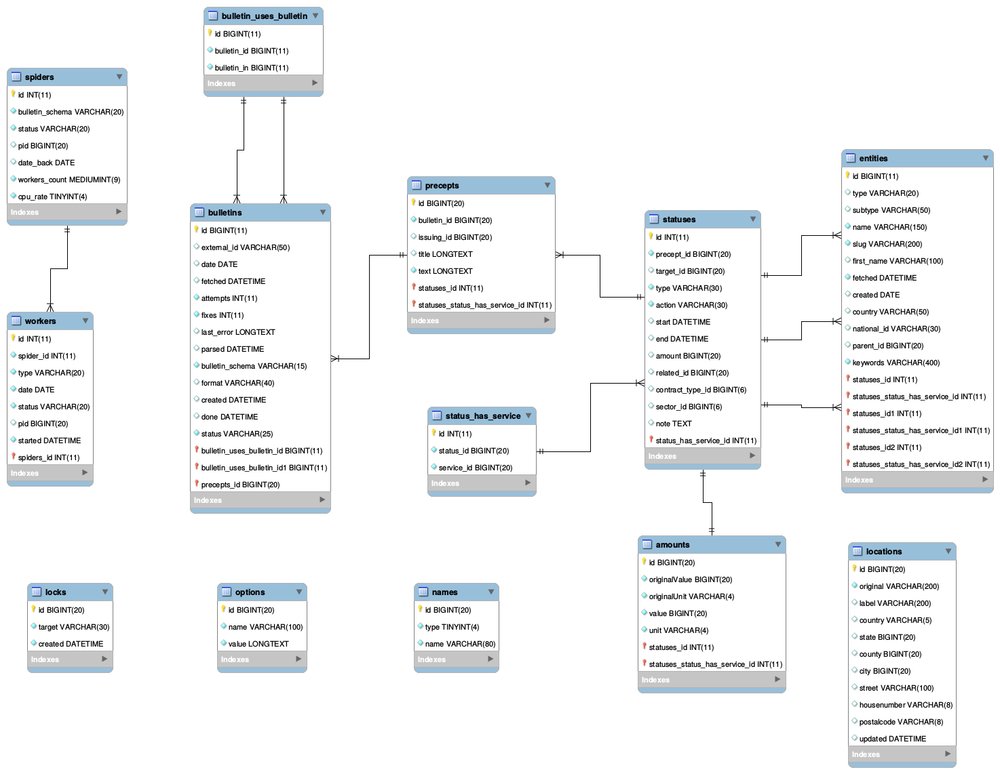

<div align="center" id="top">
	<a href="https://github.com/StateMapper/StateMapper#top" title="Go to the project's homepage"></a><br>
	<h3 align="center">DEVELOPERS GUIDE</h3>
</div>

*[&larr; Project's homepage](https://github.com/StateMapper/StateMapper#top)*

-----


**Index:** [Workflow](#workflow) · [Extraction](#extraction) · [Folder structure](#folder-structure) · [URI structure](#uri-structure) · [Helper functions](#helper-functions) · [Schemas](#schemas) · [Manuals](#manuals) · [Tips & tricks](#tips--tricks)

If you consider contributing to this project, we highly recommend you read and follow our [Team privacy guide](PRIVACY.md#top) before you continue reading.


## Workflow:

The processing layers can be described as follows:

| | Layer name | Responsability |
| -------- | ---- | --- |
|  | daemon | start and stop bulletin spiders |
|  | spider | trigger workers to fetch, parse and extract bulletins |
|  | fetch | download bulletins from bulletin providers |
|  | parse | parse bulletins and trigger subsequent fetches (follows) |
|  | extract | extract precepts and status from parsed objects |
|  | controller | route calls and prepare data for the templates |

- The daemon throws spiders (one per type of bulletin), which in their turn throw workers (one per day and type of bulletin). 
- Workers call the parser (parsing layer), which calls the fetcher (fetch layer) every time it needs (once for the daily summary, and often many times more for sub-documents).
- Then the workers, if configured to, can call the extractor (extract layer) on the parsed object to convert it to *entities* (*institutions*, *companies* and *people*), *precepts* (small texts) and *statuses* (tiny pieces of information). 
- The controller and api layers are only here to route HTTP and CLI calls to the frontend GUI, and to each processing layer separately.



The source file of this diagram can be found at ```documentation/diagrams/classes_diagram.dia``` and edited with [Dia](http://dia-installer.de/download/linux.html): ```sudo apt-get install dia```


## Extraction:

The extraction layer is where data is finally saved to the database in the form of very small pieces of information (called *status*), linked to their original text (called *precept*). During this step, several tables are filled:

| Table | Content |
| ---- | ----- |
| precepts | original texts (articles) to extract information (statuses) from |
| statuses | single, small, dated informations about one or several entities |
| entities | legal actors; currently of three types:  *person*,  *company* and  *institution* |
| amounts | amounts related with the status, with units and USD values |
| locations | status-related locations, holding the full address |
| location_states | the world's states |
| location_counties | the world's counties/provinces/regions |
| location_cities | the world's cities |

Please read the [Extraction section of the Schemas documentation](SCHEMAS.md#extraction-format) for more details about the extraction format.

Here is an overview of the database tables:



The source file of this diagram can be found at ```documentation/diagrams/database_diagram.mwb``` and edited with [MySQL Workbench](https://www.mysql.com/products/workbench/design/).


## Folder structure:

| Folder | Description |
| ------- | ------ |
| [bulletins/](../../bulletins) | where bulletins are stored after download |
| [database/](../../src/database) | database files (including .sql) |
| [documentation/](../../documentation) | documentation files (graphic material, diagrams, manuals..) |
| [schemas/](../../schemas) | bulletin definitions (schemas) per country/continent |
| [scripts/](../../scripts) | bash scripts (```smap``` command) |
| [src/](../../src) | core files of the app |
| [src/controller/](../../src/controller) | controller layer |
| [src/fetcher/](../../src/fetcher) | fetch layer |
| [src/parser/](../../src/parser) | parse layer |
| [src/extractor/](../../src/extractor) | extract layer |
| [src/daemon/](../../src/daemon) | daemon script |
| [src/spider/](../../src/spider) | spider (and workers) layer |
| [src/templates/](../../src/templates) | page and partial template files |
| [src/helpers/](../../src/helpers) | helper functions |
| [src/addons/](../../src/addons) | addons likes Wikipedia suggs, Geoencoding, Website autodetection..  |
| [src/languages/](../../src/languages) | translation files |
| [src/assets/](../../src/assets) | web assets of the app (images, fonts, .css, .js, ..) |


## URI structure:

| URI pattern  | Page description |
| ------------- | ------------- |
| [/](https://statemapper.net/) | site root |
| [/institutions](https://statemapper.net/institutions) | list of all extracted institutions |
| [/companies](https://statemapper.net/companies) | list of all extracted companies |
| [/people](https://statemapper.net/people) | list of all extracted people |
| [xx/institutions](https://statemapper.net/es/institutions) | list of all extracted institutions from xx |
| [xx/companies](https://statemapper.net/es/companies) | list of all extracted companies from xx |
| [xx/people](https://statemapper.net/es/people) | list of all extracted people from xx |
| | |
| /xx/institution/entityslug | the sheet of an institution from country xx |
| /xx/company/entityslug | the sheet of a company from country xx |
| /xx/person/john-doe | the sheet of a person from country xx |
| | |
| [/providers](https://statemapper.net/providers) | list of countries, bulletin providers and schemas |
| [/xx/providers](https://statemapper.net/es/providers) | list of bulletin providers and schemas for country xx (example: [/es/providers](https://statemapper.net/es/providers)) |
| | |
| [/api/CALL.json](https://statemapper.net/api/providers.json) | JSON API endpoints start with ```api/``` and end up in ```.json``` |


## Helper functions:

Helpers function are files holding all sorts of useful functions for many tasks. All the following helpers are located in ```src/helpers/THE_HELPER.php```, and most are loaded from ```src/helpers/boot.php``` (where these descriptions are, too):

| Helper | Description |
| ---- | ---- |
| boot | helpers' initialization (includes all the following) |
| compile | manuals' compilation methods (generates this manual) |
| export | export function for database structure dump |
| actions | actions (hooks) and filters, to add modularity |
| ajax | ajax handling |
| cli | command-line help (CLI) |
| system | system/disk helpers |
| access | access, roles, auth.. |
| live | method to lazy-load/process pieces of HTML |
| table | print uniform tables |
| cache | database caching |
| api | JSON and document APIs |
| locks | locks, for workers to be able to process in parallel |
| log | log / output for logging |
| options | manage global persistent options |
| error | error handling |
| encoding | encoding/charset conversion |
| language | internationalization |
| templates | templating system |
| entities | entities helper functions |
| statuses | status' helper functions |
| law | disclaimers |
| spiders | spiders helpers |
| locations | geolocation methods |
| string | string processing |
| currency | currencies handling |
| fetch | remote URL fetching |
| urls | URL/permalinks helpers |
| seo | search engine optimization (SEO) |
| images | images optimization (still under development, not called yet) |
| time | time/duration/date functions |
| db | database and query handler |
| bulletins | bulletin helpers |
| schemas | schemas helpers |
| labels | label sets |
| map | map/rewind methods |
| file | local file handling |
| menu | menu functions |
| names | people's name helpers |
| assets | asset management (css, js..) |
| license | licensing helpers |
| lists | entity lists management |
| daemon | daemon control functions (only via CLI) |
| admin | admin utility functions (only via CLI) |
| tests | testing functions (only via CLI) |
| error-class |  |


## Schemas:

Please refer to the [Schemas documentation](SCHEMAS.md#top).

## Manuals:

If needed, please edit Github manuals from ```documentation/manuals/templates``` (```.tpl.md``` files) and ```documentation/manuals/parts``` (```.part.md``` files). 

Patterns like ```{Include[Inline] name_of_part_file}``` and ```{Include[Inline] name_of_part_file(var1[, var2, ..])}``` will be replaced by the part file ```documentation/manuals/parts/name_of_part_file.part.md```, with patterns ```{$1}```, ```{$2}```, ```{$3}``` replaced by arguments ```var1```, ```var2```, ```var3```.

Before commiting your changes, compile the manuals to ```documentation/manuals``` (```.md``` files) with ```smap compile```.

## Tips & tricks:

* If you ever need to hide yourself when pushing changes, we recommend you create a Github user with a dedicated mailbox from [RiseUp](https://account.riseup.net/user/new) or [ProtonMail](https://protonmail.com/signup). Also, we recommend you also use RiseUp's [VPN Red](https://riseup.net/en/vpn). To do so, follow [these instructions](https://riseup.net/en/vpn/vpn-red/linux).

**Debug & errors:**

* the ```debug($whatever, $echo = true)``` will print whatever variable in a JSON human-readable way.
* the ```die_error($string, $opts = array())``` will generate a beautiful error on the web GUI (and a nice response on the JSON and CLI APIs too).
* when logged in (from the copyright's menu), executed queries can be displayed clicking the "X queries" icon in the footer.

**Disk space:**

* When developing and fetching lots of bulletins, sometimes you won't have enough space on your local disk.
   To move everything to a new disk, we recommend using the following command (respecting the trailing slashes):

   ```bash
   rsync -arv --size-only /var/www/html/statemapper/bulletins/ /path/to/your/external_disk/statemapper/bulletins
   ```

   Then modify the ```DATA_PATH``` in ```config.php```.

* To delete all files from a specific extension (say .pdf), use the following:

   ```bash
   find /var/www/html/statemapper/bulletins/ -name "*.pdf" -type f -delete
   ```

**Special URL parameters:**

* In general, you may use "?stop=1" to stop auto-refreshing (the rewind map, for example), and be able to edit the DOM/CSS more easily.
* In general, you may use "?human=1" to format a JSON API output for humans.

**Graphics:**

* The main logo was made using the [Megrim font](../../src/assets/font/megrim) and the [FontAwesome](http://fontawesome.io/icons/)'s "map-signs" icon. Source files can be found in the [logo documentation folder](../logo) (```.xcf```) and opened with [GIMP](https://www.gimp.org/).
* Please optimize all images included in the web front, and keep original files. To optimize all the images in the current folder, try the following:
   ```bash
   find ./ -type f -iname "*.FORMAT" -exec mogrify -verbose -format FORMAT -layers Dispose -resize HEIGHT\>xWIDTH\> {} + # to resize all images in the CURRENT folder (recursive)
   optipng *.png # to optimize all png files in the CURRENT folder
   ```
   .. where FORMAT is ```png``` or ```jpg```, and HEIGHT and WIDTH are the destination dimensions.1

* Favicons can be generated on-the-fly from ```https://statemapper.net/src/addons/fontawesome_favicons/[the-icon-code].ico``` with optional parameters ```?color=ffffff``` for icon color and ```?bg=000000``` for background color. Example: <a href="https://statemapper.net/src/addons/fontawesome_favicons/home.ico?bg=DEDEDE&color=D20075"></a>


-----

*[&larr; Project's homepage](https://github.com/StateMapper/StateMapper#top) · Copyright &copy; 2017-2018 [StateMapper.net](https://statemapper.net) · Licensed under [GNU AGPLv3](../../LICENSE) · [&uarr; top](#top)*  <a href="https://statemapper.net" target="_blank"></a>

